#review 

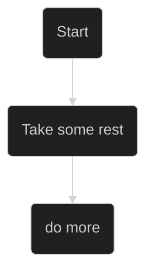

[Mermaid Theming](https://mermaid.js.org/config/theming.html)

# 1. Mermaid Theme List

base (único tema personalizável)

dark

default

forest

mc

neo

neo-dark

neutral

# Visão TODO
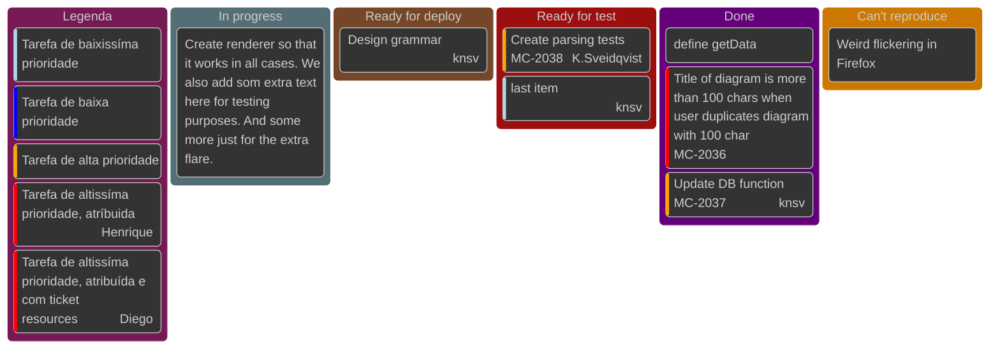

Os links infelizmente não funcionam como deveriam. No github não apresentam função. Por hora a frustração foi suficiente para criar camadas de distração. Vou tentar procurar alternativa com o gpt.

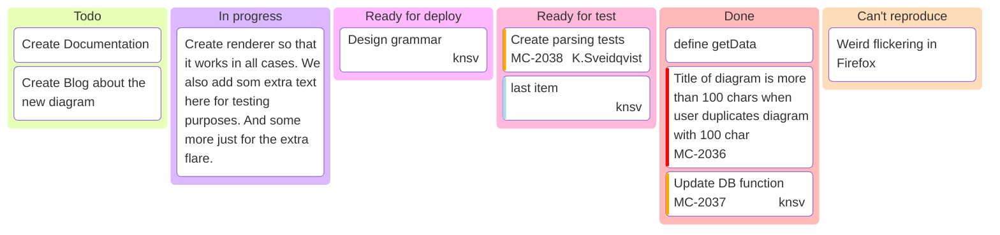

O gpt sugeriu usar uma lista de links abaixo do kanban. E tentar a opção com `graph TD`. Ambos códigos que o chatgpt gerou não estão de acordo. O segundo do tipo `graph td` renderizou mas os links não funcionam


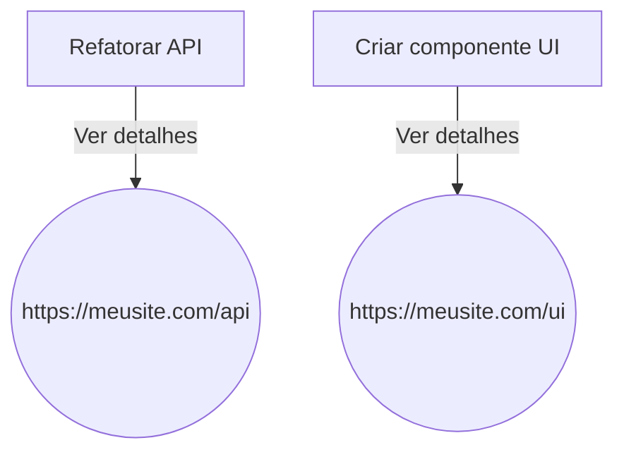

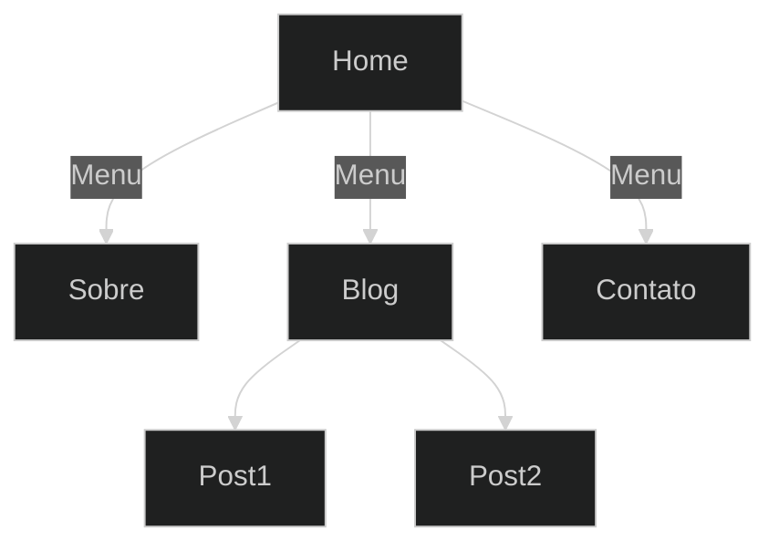

## Fluxo de usuário
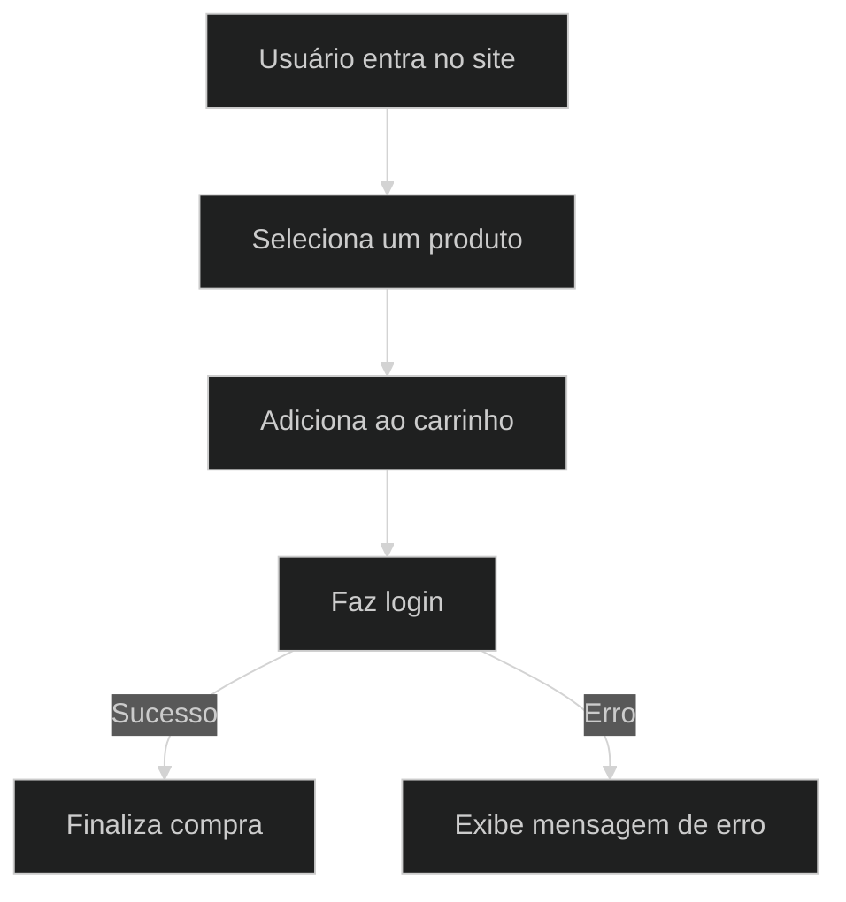

# Diagrama de banco de Dados

A melhor opção até aqui.

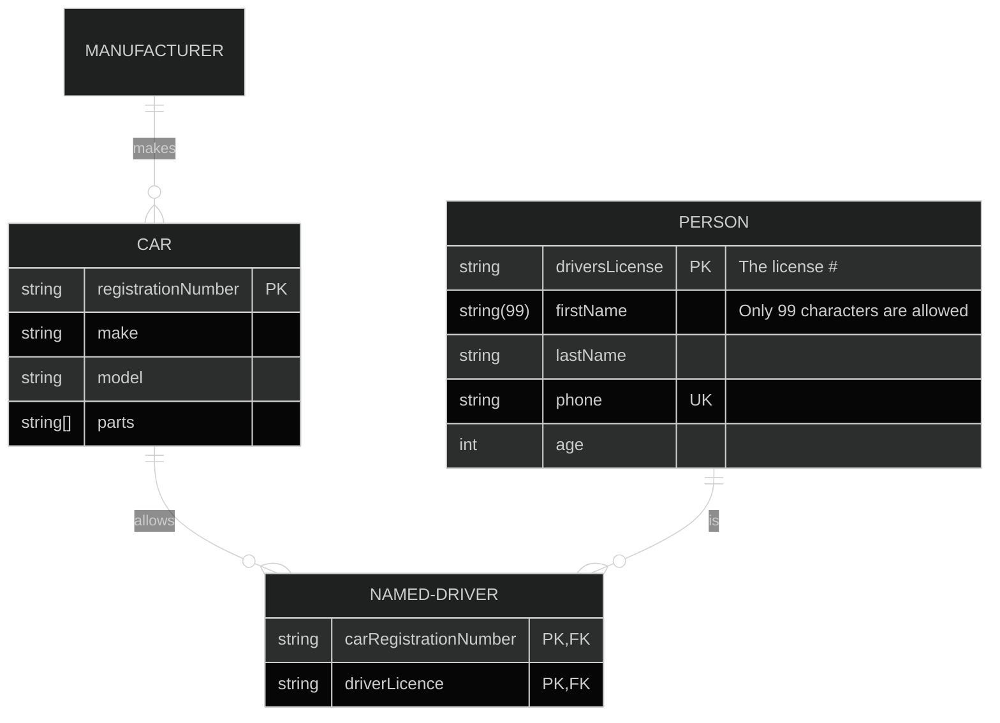

# Opções para planejar atividades

## Diagrama de Fluxo

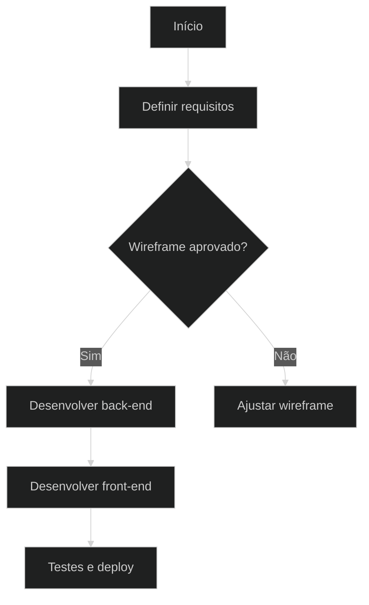

## Diagrama de estado

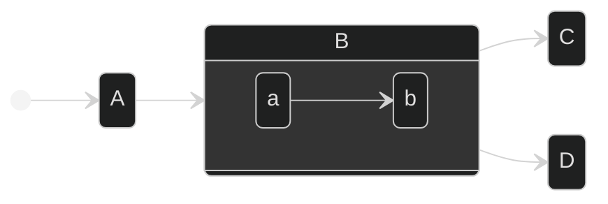

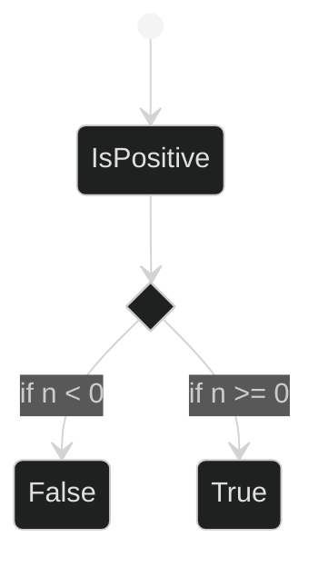

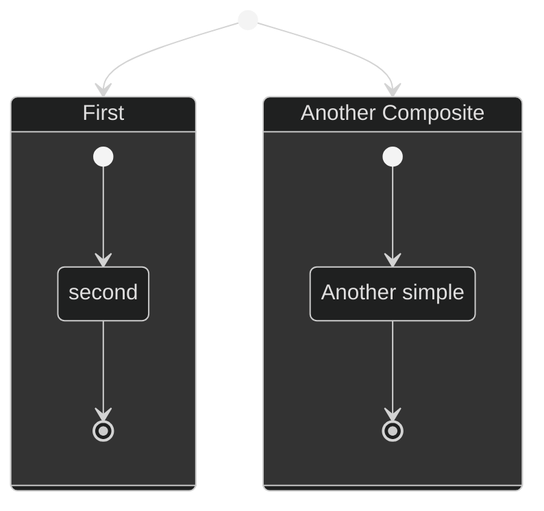

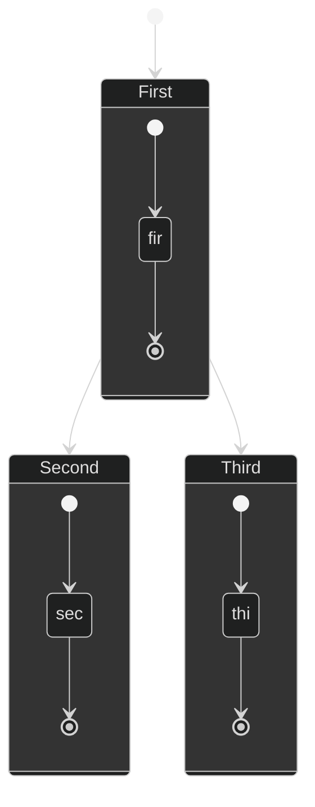
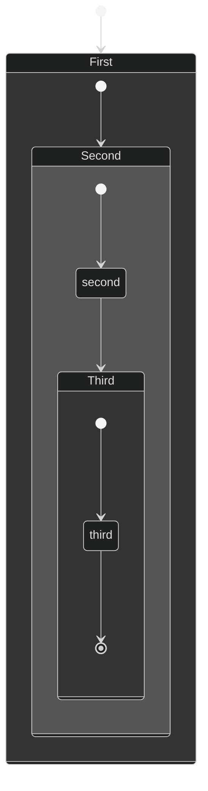

```
# 1. Backlog
now is 5:45 the time will go to 5:50 a moment of push


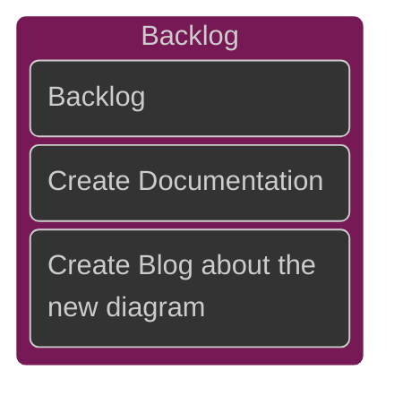

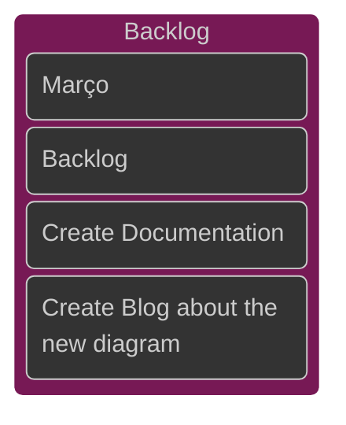
## Como configurar a base de modo customizado
```text

%%{
  init: {
    'theme': 'base',
    
    
    'themeVariables': {
    
      'primaryColor': '#0d0da2',
      Cor da célula da tarefa 
  
      'primaryTextColor': '#ffffff',
      Cor do texto
      
      'primaryBorderColor': '#4000ff',
      Bordas das celulas 
      
      'lineColor': '#ffffff',
      Não se aplica porque não há linhas
      
      'secondaryColor': '#000000',
      Não se aplica

      'tertiaryColor': '#0d0da2'
      Cor do quadrado de fundo maior.
    }
  }
}%%

```
# 2. Objetivo

# 3. Foco
# 4. Pronto para Deploy

# 5. Pronto para Teste

# 6. Concluído
# 7. Visão 3x3

ToDo, in progress, ready for deploy, ready for test, done, Can't reproduce

1.
2.
3.
4.

Adicionar e testar links (que podem levar ao numero da requisição exemplo: #001, #002, #003, #004, #005, etc)

Usar as indicações de prioridade (low, medium, high)
# Gantt
Mês dividido em 4 semanas. Adaptar este gráfico

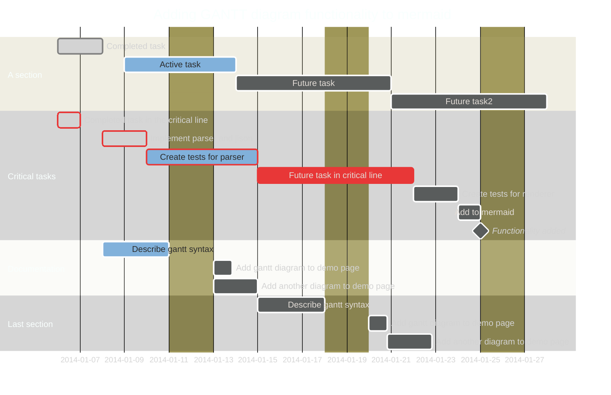

# References

Lynch, Joe (3 de março de 2025). _[Conan O'Brien Opens the 2025 Oscars With a Sandworm From 'Dune' Playing the Piano and Deadpool Dancing](https://www.billboard.com/music/awards/conan-obrien-oscars-song-1235913148/)_. _[Billboard](https://pt.wikipedia.org/wiki/Billboard "Billboard")_. Consultado em 3 de março de 2025.

O site do mermaid
# 1. Título B

# 2. Título C

# 3. Título D
# 4. Título E

# X. Referências

Lynch, Joe (3 de março de 2025). _[Conan O'Brien Opens the 2025 Oscars With a Sandworm From 'Dune' Playing the Piano and Deadpool Dancing](https://www.billboard.com/music/awards/conan-obrien-oscars-song-1235913148/)_. _[Billboard](https://pt.wikipedia.org/wiki/Billboard "Billboard")_. Consultado em 3 de março de 2025.

> [!tip]
> Todas as referências devem conter links personalizados com `<a>`. Visitar seção X.3.

# Contribuições
Específico para gists e material solo


# Agradecimentos Especiais

Se não houver nenhum dos dois acima já carregue seu card de autor que deve ser estático de preferência com a imagem mapeada em forma de vetor mapa. você também pode carregar um arquivo público de perfil e usar um ! 
Vale o teste do segundo para a atualização automática ao menos funciona dentro dos gists.


---

# X. Links e imagens 

Para facilitar publicações futuras que vão do obsidian para o github e garantir a manutenção do código no obsidian é preciso que o markdown funcione ao máximo nos dois ambientes. Caso não utilize o obsidian considere sua plataforma de edição de preferência.

Infelizmente o comportamento da marcação markdown não é interoperante em todos os interpretadores, ou seja, há diferenças de código particulares em cada um (obsidian, hyskell, github markdown, mkx e outros). Segue a tabela abaixo para tentar iluminar onde há as diferenças e demonstrar se há ou interoperabilidade entre o markdown nativo do obsidian em relação ao github markdown. 

A prioridade é implementar o [markdown do github](https://docs.github.com/pt/get-started/writing-on-github/getting-started-with-writing-and-formatting-on-github/basic-writing-and-formatting-syntax) no obsidian ainda que sejam necessárias manobras de texto para indicar sessões (no caso dos links internos e externos). 

> [!note] 
> 
> **Cabeçalho (*header*)** se refere a qualquer cabeçalho dado por #, ##, ###, ..., onde sempre é '#' na referência do link do github markdown seja um título (#) ou subtítulo (##, ###, ...).

|        Ação         |             Markdown Obsidian<br>(wikilinks disabled)              |                          Markdown Github                           | INTEROPERAÇÃO |
| :-----------------: | :----------------------------------------------------------------: | :----------------------------------------------------------------: | :-----------: |
|      Link URL       |                   `[Google](https://google.com)`                   |                 `[Google](https://google.com)`<br>                 |       ✓       |
| Link header interno |            `[Link para título](#1.1.%20Subtítulo%20A)`             |             `[Link para título sem numero](#título-a)`             |     ╳<br>     |
| Link header externo |     `[link header externo](backup.md#Backups%20alternativos)`      |     `[link header externo](/B/backup.md#backups-alternativos)`     |     ╳<br>     |
|    Link arquivo     |               `[link arquivo externo](/B/backup.md)`               |               `[link arquivo externo](/B/backup.md)`               |       ✓       |
|     imagem URL      | `` | `` |     ✓<br>     |
|   imagem<br>local   |   ``   |   ``   |       ✓       |

> [!tip] 
> Há uma série de alterações que devem ser feitas no texto ao se criar um link com o markdown do github. Segue a lista completa das recomendações abaixo. Seção X.1.

## X.1. Particularidades de como escrever um link em github markdown

1. Letras são convertidas em minúsculas.
2. Os espaços são substituídos por hífens (-). Quaisquer outros caracteres de espaço em branco ou pontuação são removidos.
3. Os espaços em branco à esquerda e à direita são removidos.
4. A formatação de marcação é removida, deixando apenas o conteúdo (por exemplo, `_italics_` torna-se italics).
5. Se a âncora gerada automaticamente para um título for idêntica a uma âncora anterior no mesmo documento, um identificador exclusivo será gerado anexando um hífen e um número inteiro de incremento automático.
6. *It doesn't matter if you're using # ## ### to size your titles they link will always have only one # like this `[text text](#link-text)`*
7. *Obviously your title Won't have - rather they'll have spaces, In the link itself replace spaces with dashes*
8. *If you're title ends with that a ? remove the ? in the link not `[text text](#link-text?)` rather `[text text](#link-text)`*

> [!important] 
> Números de seção nos títulos na ordem numero-título, exemplo, "1.1 Título", "1.1 Subtítulo" ou "1.1. Subtítulo" não são suportados no github markdown quando referenciados em links de cabeçalhos, sejam internos (do arquivo para o mesmo arquivo) ou externos (do arquivo para outro arquivo). Uma das formas de se contornar o problema é o uso da *tag anchor a e seus atributos id e href* 
> `<a id="X. Header"></a>` Pode envolver o título ou ser posicionado após o título.
> `<a href="#X. Header"></a>` Criação da referência em forma de link. Pode ser posicionado em qualquer lugar do texto.
> Segue material de orientação sobre o tema abaixo. Seção X.2.
## X.2. Como linkar um cabeçalho no mesmo arquivo 

Adicione o código antes do título ou envolvendo o título que deseja linkar

`<a id="1.1. Título A></a>` 
	 
Depois inclua a referência como link no texto onde desejar
	 
`<a href="#1.1. Título A"></a>` 
	 	 
## X.3. Como linkar um cabeçalho em um outro arquivo 

Antes do título ou envolvendo o título que deseja linkar. Neste exemplo quero definir o id do cabeçalho "2. Backups Alternativos" para depois referenciar em um link
 
`<a id="2. Backups Alternativos"></a>` 
 	  
Agora inclua a referência da localização do arquivo de destino seguido da extensão e do caractere `#` seguido da referência do id do cabeçalho
 
`<a href="/B/backup.md#2. Backups Alternativos"></a>`
   
Somente funciona no github markdown dentro do github ou com extensões de suporte que renderizam em tempo real o github markdown (ex.: extensão do vscode).

## X.3 Imagens

A imagem abaixo traz o exemplo de um arquivo com local na raiz do projeto. Cada exemplo posterior adiciona 1 nível de diretório. Atenção para a extensão do arquivo e sempre usar "/" para indicar o caminho que começa na raiz do projeto.


Exemplo adicional seria `../filename.md onde` `..` significa volte a raiz do projeto e entre no endereço específico a frente.

> [!warning]
> Revisar seção X.3 sobre imagem assim que possível.
# X. Alertas NTIWC

No total são 5 alertas exclusivos do github markdown para sinalizar detalhes importantes sobre o texto. 

Segue a entrada em markdown e saída após renderização da página junto a definição

```markdown
 
> [!NOTE]  
> Highlights information that users should take into account, even when skimming.
> Destaca informações que os usuários devem levar em conta, mesmo ao folhear
 

```

> [!NOTE]  
> Optional information to help a user be more successful.
> Destaca informações que os usuários devem levar em conta, mesmo ao folhear

```markdown
 
> [!TIP]
> Optional information to help a user be more successful.
> Informações opcionais para ajudar um usuário a ter mais sucesso.
 
 
```

> [!TIP]
> Optional information to help a user be more successful.
> Informações opcionais para ajudar um usuário a ter mais sucesso.

```markdown

> [!IMPORTANT]  
> Crucial information necessary for users to succeed.
> Informações cruciais necessárias para que os usuários tenham sucesso.

```

> [!IMPORTANT]  
> Crucial information necessary for users to succeed.
> Informações cruciais necessárias para que os usuários tenham sucesso.

```markdown

> [!WARNING]  
> Critical content demanding immediate user attention due to potential risks.
> Conteúdo crítico que exige atenção imediata do usuário devido a riscos potenciais


```

> [!WARNING]  
> Critical content demanding immediate user attention due to potential risks.
> Conteúdo crítico que exige atenção imediata do usuário devido a riscos potenciais

```markdown
 
> [!CAUTION]
> Negative potential consequences of an action.
> Consequências potenciais negativas de uma ação.
 
```

> [!CAUTION]
> Negative potential consequences of an action.
> Consequências potenciais negativas de uma ação.
## X.2 Convenções dos alertas NTIWC

Existem convenções para não sobrecarregar o conteúdo do alerta tendo em vista sua carga visual em relação ao texto que o precede e que o sucede. Podemos citar:

-  Não incluir título no alerta porque desconfigura a renderização. Não incluir cabeçalhos dentro do alerta (`#, ##, ###, ####`).
-  Não incluir quantidade massiva de texto que exceda 10 linhas. Se possível manter no máximo em  5.
  
Exemplo:
```markdown
> [!note] Título não deve ser escrito aqui
> #, ##, ###, ####, ... Não devem ser utilizados aqui
```
